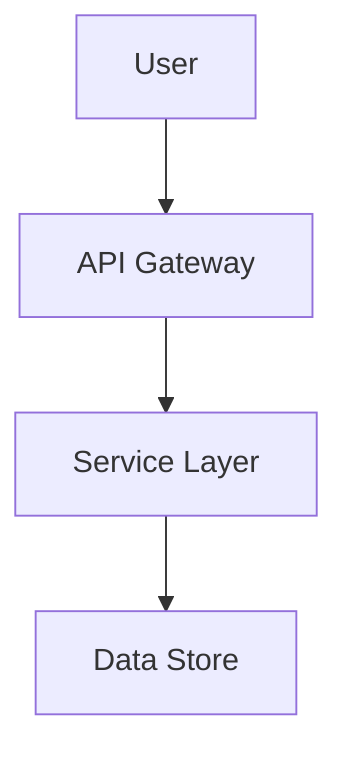
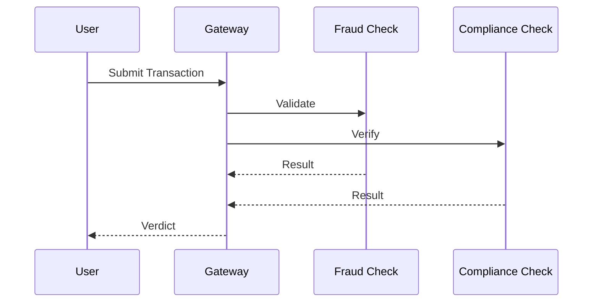

# Markdown-to-HTML Presentation Builder

A Node.js-based CLI tool for building self-contained HTML presentations from markdown content with YAML configuration.

## Features

- **Markdown to HTML**: Convert markdown slides to beautiful HTML presentations
- **YAML Manifest**: Configure slide order and inclusion via `manifest.yaml`
- **Mermaid Diagrams**: Render flowcharts, sequence diagrams, and more
- **Asset Embedding**: Embed images as base64 data URLs for self-contained HTML
- **Responsive Design**: Mobile-friendly with touch navigation support
- **Accessibility**: ARIA landmarks, keyboard navigation, skip links
- **Scroll Navigation**: Smooth scroll-snap navigation between slides

## Installation

```bash
# Clone or download the repository
git clone <repository-url>
cd md-to-html-presentation

# Install dependencies
npm install
```

## Quick Start

### 1. Create Content Structure

```bash
mkdir -p content/{architecture,systems,some-topic,challenges}
mkdir -p dist
```

### 2. Create Slide Content

Create `content/architecture/index.md`:

```markdown
---
title: "Architecture Overview"
description: "Understanding system design"
---

# Architecture

## What is Architecture?

Architecture defines the structure and behavior of systems.



Key principles:
- Modularity
- Separation of concerns
- Scalability
```

### 3. Create Manifest

Create `manifest.yaml` at repository root:

```yaml
slides:
  - path: content/architecture
    order: 1
    title: "Architecture"
  - path: content/systems
    order: 2
    title: "Systems"
  - path: content/some-topic
    order: 3
    title: "Some Topic"
  - path: content/challenges
    order: 4
    title: "Challenges"
```

### 4. Build Presentation

```bash
npm run build
# or directly:
node build.js
```

### 5. View Presentation

```bash
# Open in browser
open dist/presentation.html  # macOS
xdg-open dist/presentation.html  # Linux
start dist/presentation.html  # Windows

# Or use a local server
npx serve dist
```

## CLI Usage

```bash
node build.js [options]
```

### Options

| Option | Alias | Type | Default | Description |
|--------|-------|------|---------|-------------|
| `--config` | `-c` | string | `manifest.yaml` | Path to manifest YAML file |
| `--output` | `-o` | string | `dist/presentation.html` | Output HTML file path |
| `--content-dir` | `-d` | string | `content` | Content directory path |
| `--verbose` | `-v` | boolean | `false` | Enable verbose logging |
| `--help` | `-h` | boolean | - | Show help message |

### Examples

```bash
# Build with default settings
node build.js

# Use custom manifest
node build.js --config custom-manifest.yaml

# Custom output location with verbose logging
node build.js --output my-presentation.html --verbose

# Specify content directory
node build.js --content-dir slides --output presentation.html
```

## Exit Codes

| Code | Meaning |
|------|---------|
| 0 | Success |
| 1 | Build failure (runtime errors, processing errors) |
| 2 | Configuration error (invalid manifest, missing files) |

## Manifest Format

The `manifest.yaml` file configures your presentation:

```yaml
# Optional: Presentation metadata
title: "My Presentation"
author: "John Doe"
date: "2024-01-01"
theme: "default"

# Required: Array of slides
slides:
  # Slide with all options
  - path: content/architecture
    order: 1
    title: "Architecture Overview"
    included: true

  # Slide with minimal options (order and included are optional)
  - path: content/systems
    # order defaults to array position
    # included defaults to true
```

### Manifest Properties

- `title` (optional): Presentation title
- `author` (optional): Author name
- `date` (optional): Presentation date
- `theme` (optional): Theme name (default: "default")
- `slides` (required): Array of slide configurations
  - `path` (required): Path to slide content directory
  - `order` (optional): Display order (defaults to array position)
  - `title` (optional): Slide title
  - `included` (optional): Include in presentation (defaults to true)

## Slide Content Format

Each slide is a markdown file with YAML frontmatter:

```markdown
---
title: "Slide Title"
description: "Slide description"
author: "Optional Author"
date: "Optional Date"
tags:
  - tag1
  - tag2
layout: "default"
---

# Main Heading

## Section

Content here...


```

### Slide Types

Slides are automatically detected based on content:

- **Title**: Starts with `#` heading
- **Content**: Regular markdown content
- **Diagram**: Contains Mermaid code blocks
- **Image**: Contains image references

## Mermaid Diagrams

Supported diagram types:

- Flowcharts (`flowchart`, `graph`)
- Sequence diagrams
- Class diagrams
- State diagrams
- Entity-Relationship diagrams
- Gantt charts
- Pie charts
- Journey diagrams
- Git graphs

### Example



## Asset Management

### Supported Formats

- PNG
- JPG/JPEG
- SVG

### Size Limit

Maximum file size: 5MB

### Embedding

Images are automatically embedded as base64 data URLs, making the HTML completely self-contained.

Reference images in markdown:

```markdown


```

## Testing

### Run All Tests

```bash
npm test
```

### Run Unit Tests Only

```bash
npm run test:unit
```

### Run Integration Tests Only

```bash
npm run test:integration
```

## Error Handling

The tool provides detailed error messages with suggested fixes:

```
✖ Error:
  Code: DIRECTORY_NOT_FOUND
  Message: Content directory "content" does not exist

💡 Suggested fix:
  Check that the directory "content" exists. Create it or update the manifest path.
```

### Common Errors

| Error Code | Meaning | Fix |
|------------|---------|-----|
| `MANIFEST_NOT_FOUND` | No manifest.yaml found | Create manifest.yaml with slides array |
| `DIRECTORY_NOT_FOUND` | Slide directory missing | Create directory or fix path |
| `DUPLICATE_ORDER` | Duplicate order numbers | Use unique order values |
| `FRONTMATTER_PARSE_ERROR` | Invalid YAML frontmatter | Check YAML syntax |
| `DIAGRAM_SYNTAX_ERROR` | Invalid Mermaid syntax | Fix diagram code |

## Keyboard Navigation

Once the presentation is open in a browser:

- **Arrow Down / Page Down / Space**: Next slide
- **Arrow Up / Page Up**: Previous slide
- **Home**: First slide
- **End**: Last slide

## Touch Navigation

- **Swipe up/down**: Navigate between slides
- **Tap arrows**: Navigate using on-screen buttons

## Browser Support

- Chrome/Edge (latest)
- Firefox (latest)
- Safari (latest)

## License

MIT License
