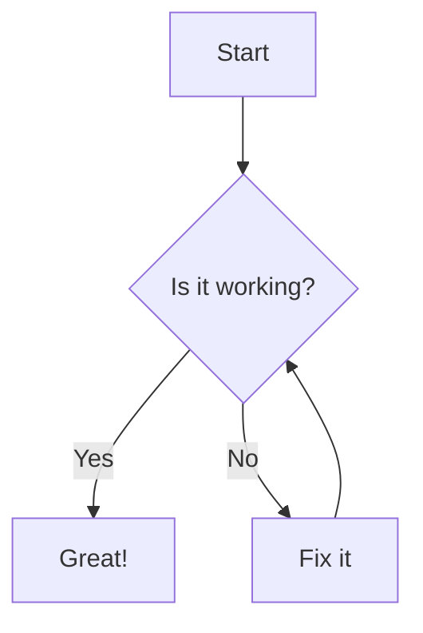
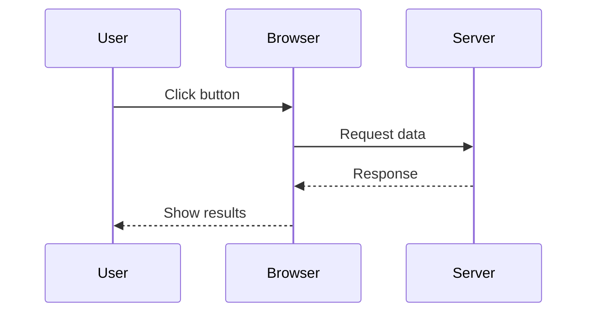

# Test Mermaid Diagrams

## Flowchart

```mermaid
flowchart TD
  A[Start] --> B{Is it working?}
  B -->|Yes| C[Great!]
  B -->|No| D[Fix it]
  D --> B
```

## Sequence Diagram

```mermaid
sequenceDiagram
  participant User
  participant Browser
  participant Server
  User->>Browser: Click button
  Browser->>Server: Request data
  Server-->>Browser: Response
  Browser-->>User: Show results
```
