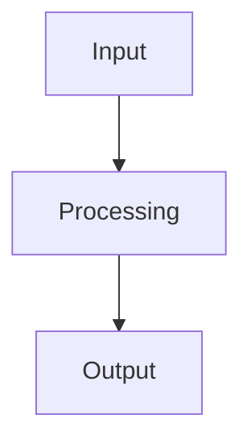

# Data Model: HTML Presentation Build Pipeline

**Date**: 2025-05-18  
**Purpose**: Define entities, structures, and relationships for the build pipeline

---

## Entities

### Slide

A single presentation unit containing markdown content and optional assets.

**Attributes**:
- `name`: string (directory name, e.g., "architecture")
- `path`: string (full path to directory, e.g., "content/architecture")
- `indexFile`: string (path to index.md, e.g., "content/architecture/index.md")
- `title`: string (from frontmatter, required)
- `description`: string (from frontmatter, required)
- `order`: number (from manifest, determines presentation sequence)
- `assets`: Asset[] (images referenced in markdown)
- `diagrams`: Diagram[] (Mermaid diagrams in markdown)

**Validation Rules**:
- Directory MUST exist at `content/<name>/`
- `index.md` MUST exist in directory
- Frontmatter MUST contain `title` and `description`
- `title` MUST be non-empty string (max 200 characters)
- `description` MUST be non-empty string (max 500 characters)

**Relationships**:
- Contains 0..* Assets
- Contains 0..* Diagrams
- Ordered by Manifest

---

### Manifest

Configuration file defining slide order and inclusion.

**Attributes**:
- `slides`: SlideEntry[] (ordered list of slide configurations)

**SlideEntry Structure**:
```yaml
- path: string (content directory name, e.g., "architecture")
  order: number (presentation order, must be unique)
```

**Validation Rules**:
- File MUST exist at repository root as `manifest.yaml`
- MUST be valid YAML
- MUST contain `slides` array
- Each entry MUST have `path` and `order` fields
- `order` values MUST be unique (no duplicates)
- All referenced `path` values MUST exist as directories
- Each directory MUST contain valid `index.md`

**Relationships**:
- References 1..* Slides
- Determines presentation order

---

### Asset

Image file referenced by a content file.

**Attributes**:
- `sourcePath`: string (relative path from content directory)
- `mimeType`: string (image/png, image/jpeg, image/svg+xml)
- `base64`: string (base64-encoded content)
- `size`: number (file size in bytes)

**Validation Rules**:
- File MUST exist at referenced path
- MUST be PNG, JPG, JPEG, or SVG format
- File size SHOULD be <5MB (fail build if exceeded)
- Path MUST be relative to content directory

**Relationships**:
- Belongs to 1 Slide
- Referenced by Slide's markdown content

---

### Diagram

Mermaid diagram definition within content file.

**Attributes**:
- `source`: string (Mermaid syntax from code block)
- `type`: string (flowchart, sequenceDiagram, classDiagram, etc.)
- `svg`: string (rendered SVG output)
- `content`: string (parent content file name)

**Validation Rules**:
- MUST be valid Mermaid syntax
- MUST render without errors
- SVG output MUST be valid XML

**Relationships**:
- Belongs to 1 Slide
- Rendered by Mermaid.js

---

## State Transitions

### Build Process States

```
[Idle] → [Parsing Manifest] → [Validating Content] → [Processing Assets]
    ↓
[Rendering Diagrams] → [Generating HTML] → [Complete]
    ↓ (on error)
[Failed]
```

**Error Conditions**:
- Manifest parse failure → Failed
- Missing content directory → Failed
- Missing index.md → Failed
- Invalid frontmatter → Failed
- Missing asset → Failed
- Diagram render failure → Failed

---

## File Structures

### manifest.yaml (Manifest)

```yaml
slides:
  - path: architecture
    order: 1
  - path: systems
    order: 2
  - path: some-topic
    order: 3
  - path: challenges
    order: 4
```

### index.md (Content File)

```markdown
---
title: "Architecture Overview"
description: "Explaining good vs bad friction in system design"
---

# Architecture

Content here...




```

### package.json

```json
{
  "name": "presentation-builder",
  "version": "1.0.0",
  "type": "module",
  "scripts": {
    "build": "node build.js",
    "test": "jest"
  },
  "dependencies": {
    "js-yaml": "^4.1.0",
    "remark": "^15.0.0",
    "remark-frontmatter": "^5.0.0",
    "unist-util-visit": "^5.0.0"
  },
  "devDependencies": {
    "jest": "^29.0.0"
  }
}
```

---

## Relationships Diagram

```
┌─────────────┐
│  Manifest   │
│ (manifest.yaml)│
└──────┬──────┘
       │ references
       │ (1..*)
       ↓
┌─────────────┐
│   Content   │
│ (index.md)  │
└──────┬──────┘
       │ contains
       │ (0..*)
       ↓
┌─────────────┐      ┌─────────────┐
│   Asset     │      │  Diagram    │
│  (images)   │      │  (Mermaid)  │
└─────────────┘      └─────────────┘
```

---

## Data Flow

1. **Read Manifest**: Parse `manifest.yaml` → Array of SlideEntry
2. **Load Content**: For each entry, read `content/<path>/index.md`
3. **Parse Frontmatter**: Extract title, description from YAML frontmatter
4. **Process Markdown**: Parse content, extract asset references and diagram blocks
5. **Load Assets**: Read images from content directories, convert to base64
6. **Render Diagrams**: Execute Mermaid.js to generate SVG
7. **Generate HTML**: Combine all content with CSS/JS into single file
8. **Write Output**: Save to `dist/presentation.html`
