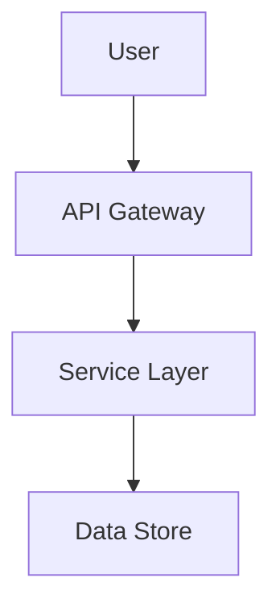
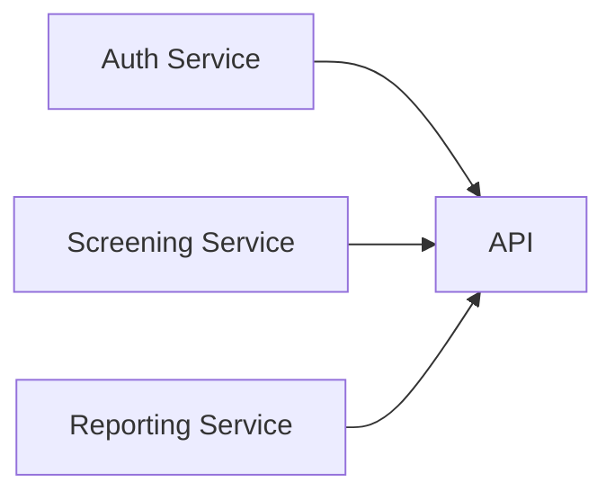
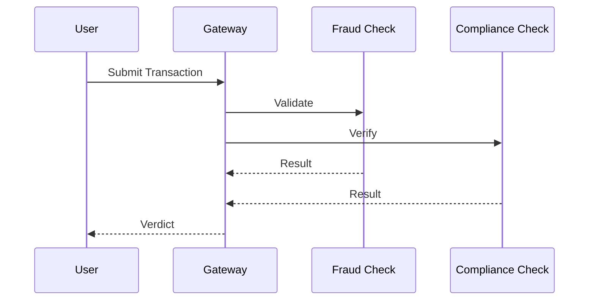

# Quickstart: HTML Presentation Build Pipeline

**Version**: 1.0.0  
**Purpose**: Get a 4-slide presentation built in under 10 minutes

---

## Prerequisites

- Node.js 18+ installed
- Basic familiarity with command line
- Text editor for writing markdown

---

## Step 1: Initialize Project

```bash
# Create project structure
mkdir -p content/{architecture,systems,some-topic,challenges}
mkdir -p dist

# Initialize package.json
npm init -y
npm install mermaid js-yaml remark remark-frontmatter unist-util-visit
```

---

## Step 2: Create Slide Content

### Architecture Slide

Create `content/architecture/index.md`:

```markdown
---
title: "Architecture Overview"
description: "Understanding good vs bad friction in system design"
---

# Architecture

## What is Architecture?

Architecture defines the structure and behavior of systems.



Key principles:
- Modularity
- Separation of concerns
- Scalability
```

### Systems Slide

Create `content/systems/index.md`:

```markdown
---
title: "Current Systems"
description: "Overview of existing services and team structure"
---

# Current Systems

## Services

Our architecture consists of multiple microservices.


```

### Some Topic Slide

Create `content/some-topic/index.md`:

```markdown
---
title: "Some Topic"
description: "Information about Some Topic"
---

# Some Topic

## Process Flow


```

### Challenges Slide

Create `content/challenges/index.md`:

```markdown
---
title: "Challenges Ahead"
description: "Regulatory requirements and event-driven contracts"
---

# Challenges Ahead

## Key Areas

1. Transaction monitoring at scale
2. Evolving regulatory requirements
3. Event-driven architecture contracts
4. SLA management for priority transactions
```

---

## Step 3: Create Manifest

Create `manifest.yaml` at repository root:

```yaml
slides:
  - path: architecture
    order: 1
  - path: systems
    order: 2
  - path: some-topic
    order: 3
  - path: challenges
    order: 4
```

---

## Step 4: Create Build Script

Create `build.js`:

```javascript
import fs from 'fs';
import yaml from 'js-yaml';
import { remark } from 'remark';
import frontmatter from 'remark-frontmatter';
import { visit } from 'unist-util-visit';

// Load manifest
const manifest = yaml.load(fs.readFileSync('manifest.yaml', 'utf8'));

// Sort slides by order
const slides = manifest.slides.sort((a, b) => a.order - b.order);

// Process each slide
const slideContents = [];
for (const slide of slides) {
  const indexPath = `content/${slide.path}/index.md`;
  const content = fs.readFileSync(indexPath, 'utf8');
  
  // Parse frontmatter and content
  const processed = await remark()
    .use(frontmatter)
    .process(content);
  
  slideContents.push({
    path: slide.path,
    order: slide.order,
    content: String(processed)
  });
}

// Generate HTML (simplified - full implementation includes CSS, JS, asset embedding)
const html = `<!DOCTYPE html>
<html lang="en">
<head>
  <meta charset="UTF-8">
  <meta name="viewport" content="width=device-width, initial-scale=1.0">
  <title>Presentation</title>
  <style>
    body { margin: 0; scroll-behavior: smooth; }
    main { scroll-snap-type: y mandatory; height: 100vh; overflow-y: scroll; }
    section { scroll-snap-align: start; height: 100vh; padding: 2rem; }
  </style>
</head>
<body>
  <main>
    ${slideContents.map(slide => `
    <section id="${slide.path}">
      ${slide.content}
    </section>
    `).join('')}
  </main>
</body>
</html>`;

fs.mkdirSync('dist', { recursive: true });
fs.writeFileSync('dist/presentation.html', html);
console.log('Build complete: dist/presentation.html');
```

---

## Step 5: Build Presentation

```bash
node build.js
```

Expected output:
```
Build complete: dist/presentation.html
```

---

## Step 6: View Presentation

```bash
# Open in default browser
open dist/presentation.html  # macOS
xdg-open dist/presentation.html  # Linux
start dist/presentation.html  # Windows

# Or use a local server
npx serve dist
```

---

## Next Steps

1. **Add images**: Place images in slide directories and reference them in markdown
2. **Add diagrams**: Expand Mermaid diagrams for complex visualizations
3. **Customize styling**: Modify the embedded CSS in `build.js`
4. **Add interactivity**: Extend JavaScript for navigation controls

---

## Troubleshooting

### Error: "Cannot find module 'js-yaml'"

```bash
npm install js-yaml
```

### Error: "Directory 'content/architecture' does not contain index.md"

Create the missing file:
```bash
touch content/architecture/index.md
```

### Error: "Missing required frontmatter field: title"

Ensure each `content/*/index.md` has:
```markdown
---
title: "Your Title"
description: "Your description"
---
```

---

## Verification Checklist

- [ ] All 4 content directories created
- [ ] Each directory contains `index.md` with valid frontmatter
- [ ] `manifest.yaml` exists at repository root
- [ ] `build.js` runs without errors
- [ ] `dist/presentation.html` opens in browser
- [ ] Scrolling navigates between slides
- [ ] Mermaid diagrams render correctly
